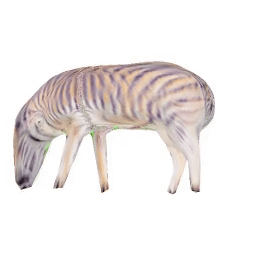

## SAOR: Single-View Articulated Object Reconstruction

SAOR is a novel approach for estimating the 3D shape, texture, and viewpoint of an articulated object from a single image captured in the wild. Unlike prior approaches that rely on pre-defined category-specific 3D templates or tailored 3D skeletons, SAOR learns to articulate shapes from single-view image collections with a skeleton-free part-based model without requiring any 3D object shape priors. Our method only requires estimated object silhouettes and relative depth maps from off-the-shelf pre-trained networks during training. At inference time, given a single-view image, it efficiently outputs an explicit mesh representation.


## Setup

This code tested using Python 3.10.14, PyTorch 1.12.1 and CUDA 11.3 on a Ubuntu 20.04 machine.

First, clone the github repo...

```bash
git clone git@github.com:MehmetAygun/saor_clean.git
cd saor
```

Then use `conda`  to create the conda environment via

```bash
conda env create -f saor.yml
```

then activate via:

```bash
conda activate saor
```


## Usage

### 3D Reconstruction

You can use src/reconstruct.py script to generate 3D of various animals. Here put your images under the input_folder.
The below script would create various outputs like 3D object file, part visualisations and if --gif flag given 360 videos.
The output files would be written into input_folder_rec folder.

You can download pretrained SAOR that work 101 different categories using this <a href="https://drive.google.com/file/d/1nMRnr3PrwUE7BZMMWuTGds330uvTv8yP/view?usp=sharing">link</a>.


```bash
python src/reconstruct.py --i input_folder --m model_file.pkl --gif
```


### Articulation Transfer

As SAOR disentangle articulation and deformation, you can transfer articulation of an animal to another one.
For this you can use src/transfer_art.py script, for example:

```bash
python src/transfer_art.py --m models/saor_101_surgical.pkl --src assets/zebra1.png --trg assets/zebra2.png --output_folder articulation_example
```

would output save the below video into articulation_example folder.




## Citation

If you find our paper or code useful, please cite our paper:

```bibtex
@inproceedings{aygun2024saor,
    title={SAOR: Single-View Articulated Object Reconstruction}, 
    author={Ayg{\"u}n, Mehmet and Mac Aodha, Oisin},
    booktitle={CVPR},
    year={2024},
}
```

### Acknowledgements

The code is derived and mainly mainly based on <a href="https://github.com/monniert/unicorn">Unicorn</a>.

